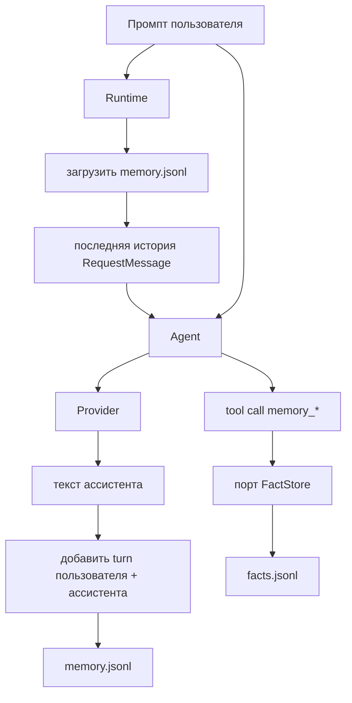
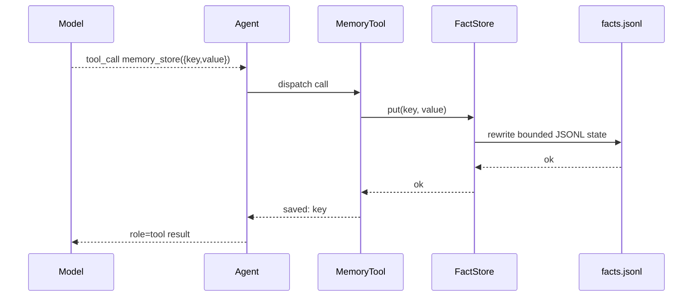

# Память

В `nllclw` есть две системы памяти:

1. transcript memory, которая хранит последние пары user/assistant;
2. durable fact memory, которая хранит факты с ключами через явные инструменты.

Обе системы по умолчанию являются JSONL-файлами в пользовательском каталоге
состояния, а не рядом с бинарником и не в текущем проекте.

## Обзор



## Transcript Memory

Transcript memory включена по умолчанию:

```sh
NLLCLW_MEMORY=on
# Default: user state dir/memory.jsonl
NLLCLW_MEMORY_MAX_MESSAGES=20
```

`NLLCLW_MEMORY_MAX_MESSAGES` должен быть не меньше 2, потому что transcript
appends сохраняются парами user/assistant.

Каждая строка является одним JSON-объектом:

```json
{"role":"user","content":"remember that this project uses Zig 0.16"}
{"role":"assistant","content":"Got it."}
```

При запуске turn:

1. `runtime.zig` открывает настроенное transcript store.
2. `memory.zig` разбирает JSONL-строки.
3. Некорректные роли, некорректный JSON, некорректный UTF-8 или binary control
   bytes приводят к ошибке памяти.
4. Сохраняются только новейшие `NLLCLW_MEMORY_MAX_MESSAGES` записей.
5. Записи преобразуются в request messages Chat Completions.

После успешного ответа ассистента `Runtime.appendMemory` добавляет prompt
пользователя и текст ассистента. Если append завершается ошибкой, уже
полученный ответ ассистента все равно печатается, а канал сообщает warning.

Transcript snapshots ограничены 256 KiB, тем же лимитом, который используется
при загрузке JSONL-файла. Слишком большие turns отклоняются до atomic replace,
поэтому успешная запись не может создать transcript, который следующий запуск
не сможет прочитать.

## Durable Fact Memory

Fact memory предназначена для стабильных key/value фактов. Она доступна через
локальный tool loop по умолчанию, когда:

```sh
NLLCLW_MEMORY=on
NLLCLW_TOOLS=on
```

Defaults:

```sh
# Default path: user state dir/facts.jsonl
NLLCLW_MEMORY_MAX_FACTS=64
```

`NLLCLW_MEMORY_MAX_FACTS` должен быть от 1 до 1024.

Каждая строка является одним JSON-объектом:

```json
{"key":"project.language","value":"Zig 0.16"}
{"key":"user.prefers","value":"direct, pragmatic answers"}
```

Fact keys:

- должны быть непустыми;
- ограничены 64 bytes;
- могут содержать буквы, цифры, `_`, `-` и `.`;
- дедуплицируются по ключу, причем новейшее значение побеждает.

Fact values:

- должны быть непустыми;
- должны содержать не-whitespace text;
- должны быть valid UTF-8;
- не должны содержать ASCII control bytes;
- ограничены 2048 bytes;
- должны помещаться в `NLLCLW_TOOL_OUTPUT_MAX_BYTES` при возврате через
  `memory_recall`.

Snapshot fact JSONL использует тот же 256 KiB read/write cap, что и transcript
memory. Если множество сохраненных фактов превысит этот файловый лимит, запись
завершится ошибкой вместо создания нечитаемого facts file.

## Инструменты памяти

| Инструмент | Назначение |
|---|---|
| `memory_store` | Сохранить или обновить факт по ключу. |
| `memory_recall` | Прочитать факт по ключу. |
| `memory_list` | Перечислить известные fact keys. |
| `memory_forget` | Удалить факт по ключу. |

Tool flow:



## CLI-команды памяти

Эти команды работают с durable facts:

```sh
nllclw memory list
nllclw memory get project.language
nllclw memory forget project.language
nllclw memory reset
```

`memory reset` очищает и transcript memory, и fact memory.

## Заметки о приватности и безопасности

- Файлы памяти по умолчанию находятся в пользовательском каталоге состояния.
- `.nllclw-*` files запрещены файловым инструментам, поэтому модель не может
  читать или редактировать свои собственные memory files через `read_file`,
  `write_file` или `edit_file`.
- Память не шифруется. Не храните в ней секреты.
- Fact memory следует использовать для долговременных предпочтений
  пользователя/проекта, а не для сырых conversation logs.
