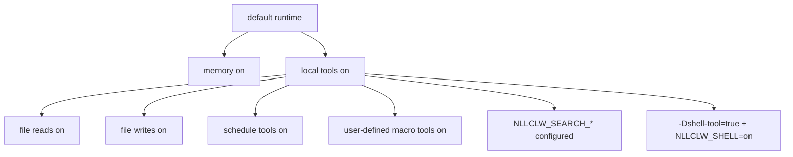

# Модель безопасности

`nllclw` является локальным AI assistant, а не sandbox. Его модель безопасности
основана на небольших local-only значениях по умолчанию, явных gates внешних
возможностей, ограниченном локальном выводе и аккуратной валидации
provider/config.

## Позиция по умолчанию

Default build:

- нет package dependencies;
- нет внешних runtime programs;
- нет `curl`;
- нет shell execution;
- локальные tools включены;
- filesystem tools включены с relative-path и secret-path protections;
- scheduler tools включены для локальных JSONL schedules;
- user-defined macro tools включены и хранятся в локальном JSONL;
- web search выключен, пока search provider не настроен;
- Telegram выключен, пока не запущен явно и не настроен с allowlist.
- WebSocket выключен, пока не запущен явно; default bind только loopback.

Память включена по умолчанию, потому что она пишет только локальные JSONL-файлы
в текущем рабочем каталоге. Ее можно выключить:

```sh
NLLCLW_MEMORY=off
```

Выключить все инструменты:

```sh
NLLCLW_TOOLS=off
```

## Capability Gates



Модель получает определения локальных инструментов по умолчанию. Внешний web
search и shell execution все равно требуют явной настройки.

## Обработка ключей провайдера

- API keys поступают из OS env, `config.json` или `.env`.
- OS env переопределяет file config, а `config.json` переопределяет `.env`.
- Completion provider keys отправляются только как `Authorization: Bearer ...`.
- Search provider keys отправляются с documented auth header каждого
  провайдера: bearer auth для Tavily и Firecrawl, `X-Subscription-Token` для
  Brave Search и `x-api-key` для Exa.
- Header values отклоняют ASCII control bytes.
- Provider model names отклоняют некорректный UTF-8 и control bytes до сборки
  request JSON.
- Chat request content strings, assistant response text и tool-call argument
  strings отклоняют некорректный UTF-8 и binary control bytes; обычные newlines,
  carriage returns и tabs остаются там valid text. Request metadata, такая как
  model names, roles, tool-call ids, function names и parameter names,
  дополнительно должна быть single-line.
- Provider response roles, когда присутствуют, должны быть `assistant`.
- Provider and Telegram diagnostic messages, которые пусты, слишком велики или
  содержат control bytes, не печатаются как доверенные single-line errors.
- Raw diagnostic response bodies печатаются только когда они являются valid
  text и ограничены в terminal output.
- Default state files находятся в user state directory. Configured state paths
  для memory, macro tools и schedules должны быть relative `.jsonl` paths с
  valid UTF-8, без control bytes, с `/` separators, без Windows-reserved
  filename characters или device names, и без пустых, `.`, `..`,
  trailing-space или trailing-dot path components.
- Local state files и их lock files открываются без следования terminal
  symlinks. Записи используют atomic replace и private file permissions там,
  где host platform их предоставляет.
- Durable fact memory values отклоняют ASCII control bytes до сохранения или
  печати путями CLI/tool recall.
- User-defined macro tool descriptions and actions отклоняют ASCII control
  bytes до сохранения или отправки обратно как model-facing tool schema/output.
- Scheduled actions отклоняют ASCII control bytes до сохранения или печати
  через schedule listing.
- Model-facing tool outputs отклоняют некорректный UTF-8 и binary control bytes.
- `.env`, `config.json` и `.nllclw-*` paths запрещены файловым инструментам.
- user-defined macro tools по умолчанию хранятся в user state directory.
- Не вставляйте реальные ключи в prompts или context files.

## Безопасность compatible provider

Compatible providers по умолчанию должны использовать HTTPS:

```json
{
  "provider": "compatible",
  "base_url": "https://example.com/v1",
  "api_key": "...",
  "model": "..."
}
```

HTTP разрешен только для точных loopback hosts и только при явном включении:

```json
{
  "provider": "compatible",
  "base_url": "http://127.0.0.1:11434/v1",
  "allow_http_base_url": true,
  "api_key": "ollama",
  "model": "llama3.2"
}
```

Удаленные HTTP URLs отклоняются.

## Граница файловых инструментов

Filesystem tools не являются полноценной sandbox, но применяют консервативную
локальную границу:

- только relative paths;
- valid UTF-8, control-free paths длиной не больше 512 bytes;
- без `..`;
- без absolute POSIX paths;
- без absolute или drive-qualified Windows paths;
- без пустых, `.`, или `..` path components, кроме того, что `list_dir`
  принимает literal `.` для текущего каталога;
- без symlink traversal для открываемых path components;
- без Windows-reserved filename characters, device names, trailing spaces или
  trailing dots;
- без `.env`, `config.json`, `.nllclw-*`, `.git`, `.ssh`, `.gnupg`, `.aws`, `.npmrc`;
- без common private-key filenames или suffixes;
- только UTF-8 text, без binary control bytes;
- output-size caps;
- atomic writes.

Запускайте с файловыми инструментами только внутри каталога, где такие
разрешения уместны.

## Граница Telegram

Telegram mode по умолчанию deny:

- `NLLCLW_TELEGRAM_TOKEN` обязателен;
- Telegram tokens валидируются как `<bot-id>:<secret>` перед помещением в Bot
  API URLs;
- `NLLCLW_TELEGRAM_CHAT_ID` обязателен;
- сообщения вне настроенного chat id или username allowlist игнорируются;
- локальный nonblocking lock отклоняет второй процесс `nllclw telegram`,
  использующий тот же state directory;
- последний обработанный update хранится локально, чтобы избежать replay после
  restart.
- model-backed messages rate-limited через
  `NLLCLW_TELEGRAM_RATE_LIMIT_PER_MINUTE`.

## Граница WebSocket

WebSocket mode по умолчанию предназначен для локальных custom UIs:

- запускается только при `nllclw websocket`;
- default bind: `127.0.0.1:8765`;
- `NLLCLW_WS_TOKEN` обязателен даже для loopback binds;
- `NLLCLW_WS_PATH` должен быть single-line valid UTF-8 без query или fragment
  syntax;
- non-loopback bind addresses требуют `NLLCLW_WS_ALLOW_REMOTE=on`;
- loopback browser clients могут передавать token как `?token=...`;
- loopback query authentication принимает ровно один параметр `token`;
- remote clients должны использовать ровно один header
  `Authorization: Bearer ...`;
- model-backed chat messages rate-limited через
  `NLLCLW_WS_RATE_LIMIT_PER_MINUTE`.
- встроенный сервер обслуживает одного active client за раз.

Не открывайте WebSocket port в недоверенную сеть без reverse proxy и transport
security. Встроенный канал является plain `ws://`, а не TLS termination.

## Граница shell tool

Default binary не включает `shell_exec`.

Чтобы shell execution стала возможной, должны быть истинны оба условия:

```sh
zig build -Dshell-tool=true
NLLCLW_SHELL=on
```

Shell tool следует считать эквивалентом выдачи модели права на local command
execution. Используйте его только в trusted environments.

## Практический checklist

Перед использованием локальных возможностей по умолчанию:

1. Запускайте в отдельном project directory.
2. Держите secrets вне prompts и context files.
3. Установите `NLLCLW_FILE_WRITE=off`, если file mutation не нужна.
4. Используйте default no-shell binary, если command execution не требуется.
5. Используйте `NLLCLW_TOOL_OUTPUT_MAX_BYTES`, чтобы держать tool output
   bounded.
6. Используйте `nllclw status` для краткой health line или `nllclw doctor` для
   полной diagnostics.
