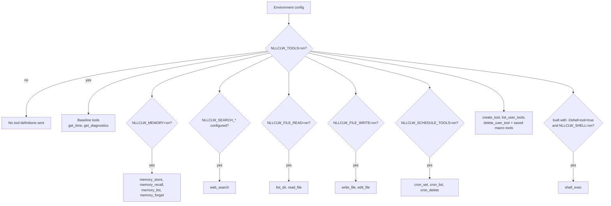
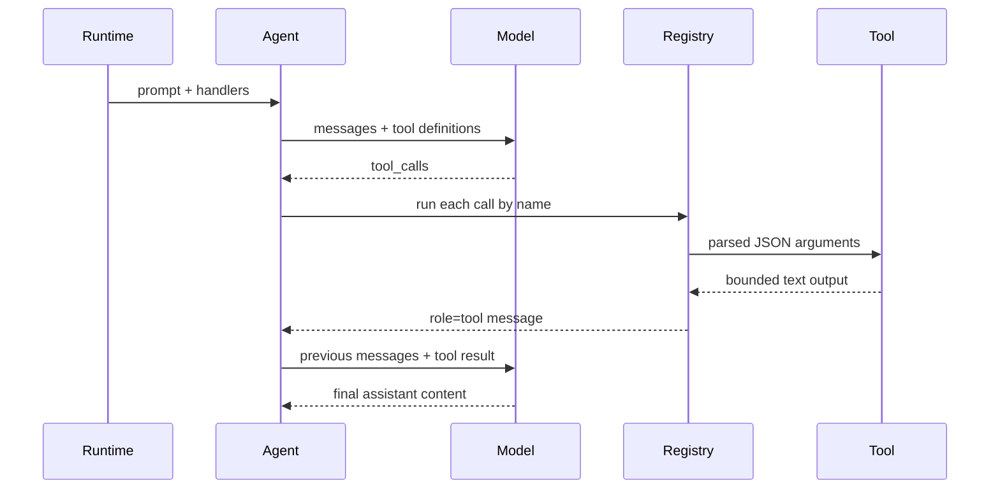

# Инструменты

Инструменты позволяют модели попросить `nllclw` выполнить локальные действия.
Локальные инструменты, которым не нужны внешние сервисы, включены по умолчанию.
Внешний web search и необязательный shell execution все равно требуют явной
настройки.

## Capability Model



Default binary не содержит `shell_exec`. Соберите его явно:

```sh
zig build -Dshell-tool=true
```

Затем включите во время выполнения:

```sh
NLLCLW_TOOLS=on
NLLCLW_SHELL=on
```

Чтобы выключить все инструменты:

```sh
NLLCLW_TOOLS=off
```

## Tool Loop



`NLLCLW_TOOL_MAX_ROUNDS` ограничивает, сколько assistant/tool exchange rounds
может произойти до возврата `ToolRoundLimit`.

Аргументы built-in tools являются точными JSON-объектами. Некорректный JSON,
отсутствующие required fields, unknown fields, invalid field types и validation
failures возвращают tool error, с которым модель может работать.

## Доступные инструменты

| Инструмент | Gate | Действие |
|---|---|---|
| `get_time` | `NLLCLW_TOOLS=on` default | Возвращает local time с учетом `NLLCLW_TIMEZONE_OFFSET_MINUTES`. |
| `get_diagnostics` | `NLLCLW_TOOLS=on` default | Сообщает runtime capability/config status. |
| `web_search` | `NLLCLW_TOOLS=on` и настроенный provider `NLLCLW_SEARCH_*` | Вызывает выбранный search provider через HTTP port. |
| `memory_store` | `NLLCLW_TOOLS=on`, `NLLCLW_MEMORY=on` defaults | Сохраняет durable fact. |
| `memory_recall` | `NLLCLW_TOOLS=on`, `NLLCLW_MEMORY=on` defaults | Читает durable fact. |
| `memory_list` | `NLLCLW_TOOLS=on`, `NLLCLW_MEMORY=on` defaults | Перечисляет durable fact keys. |
| `memory_forget` | `NLLCLW_TOOLS=on`, `NLLCLW_MEMORY=on` defaults | Удаляет durable fact. |
| `list_dir` | `NLLCLW_FILE_READ=on` default | Перечисляет CWD-relative directory. |
| `read_file` | `NLLCLW_FILE_READ=on` default | Читает UTF-8 CWD-relative file. |
| `write_file` | `NLLCLW_FILE_WRITE=on` default | Атомарно записывает UTF-8 CWD-relative file. |
| `edit_file` | `NLLCLW_FILE_WRITE=on` default | Заменяет первое точное совпадение текста в файле. |
| `cron_set` | `NLLCLW_SCHEDULE_TOOLS=on` default | Добавляет локальную scheduled task. |
| `cron_list` | `NLLCLW_SCHEDULE_TOOLS=on` default | Перечисляет scheduled tasks. |
| `cron_delete` | `NLLCLW_SCHEDULE_TOOLS=on` default | Удаляет scheduled task. |
| `create_tool` | `NLLCLW_TOOLS=on` default | Создает persistent user-defined macro tool. |
| `list_user_tools` | `NLLCLW_TOOLS=on` default | Перечисляет saved macro tools. |
| `delete_user_tool` | `NLLCLW_TOOLS=on` default | Удаляет saved macro tool. |
| saved macro tools | `NLLCLW_TOOLS=on` default | Возвращают saved action text, чтобы модель могла выполнить его через built-in tools. |
| `shell_exec` | optional shell build plus `NLLCLW_SHELL=on` | Запускает shell command с timeout, combined output cap и UTF-8 text output без binary control bytes. |

## User-Defined Tools

User-defined tools являются macro tools, а не generated code. `create_tool`
сохраняет name, description и natural-language action в
`NLLCLW_USER_TOOLS_PATH` (default `user-tools.jsonl` в user state directory).
В последующих turns saved tools рекламируются как обычные tool definitions.
Когда модель вызывает такой инструмент, `nllclw` возвращает saved action text,
и модель продолжает тот же tool loop с использованием built-in tools.

Example:

```text
create_tool(name="daily_brief", description="Prepare a daily brief", action="Search for current project news, summarize it, and store the summary in memory.")
```

Tool names могут содержать только буквы, цифры и underscores. Имена,
конфликтующие с built-in tools, отклоняются. Descriptions и actions
trimmed, bounded, valid UTF-8 text без ASCII control bytes. User-tool JSONL
file ограничен 128 KiB при чтении и записи, открывается без следования terminal
symlinks, а saved action должен помещаться в `NLLCLW_TOOL_OUTPUT_MAX_BYTES` при
оборачивании как tool result.

## Провайдеры Web Search

`web_search` является одним инструментом с провайдером, выбранным через
`NLLCLW_SEARCH_PROVIDER`. Default `auto` mode выбирает первый настроенный ключ
в порядке: Tavily, Brave Search, Exa, Firecrawl, затем DuckDuckGo только при
явном включении.
Explicit key-based providers требуют соответствующий `NLLCLW_SEARCH_*_KEY`.
Search keys не должны содержать ASCII control bytes.
Queries trimmed, valid UTF-8, control-free и не больше 512 bytes.
Provider result text форматируется как valid UTF-8 без binary control bytes;
ordinary tabs и newlines внутри result fields нормализуются в spaces.
Empty provider result objects пропускаются, а valid empty provider response
возвращает `no results` вместо synthetic placeholder row. DuckDuckGo nested
related-topic groups flatten до небольшой bounded depth.

| Provider | Env | Notes |
|---|---|---|
| `tavily` | `NLLCLW_SEARCH_TAVILY_KEY=...` | POSTs to Tavily Search. |
| `brave` | `NLLCLW_SEARCH_BRAVE_KEY=...` | GETs Brave Web Search with `X-Subscription-Token`. |
| `exa` | `NLLCLW_SEARCH_EXA_KEY=...` | POSTs Exa Search with `x-api-key`. |
| `firecrawl` | `NLLCLW_SEARCH_FIRECRAWL_KEY=...` | POSTs Firecrawl Search with bearer auth. |
| `duckduckgo` | `NLLCLW_SEARCH_DUCKDUCKGO=on` or `NLLCLW_SEARCH_PROVIDER=duckduckgo` | No-key Instant Answer fallback, not a full web SERP API. |

Examples:

```sh
NLLCLW_TOOLS=on
NLLCLW_SEARCH_PROVIDER=auto
NLLCLW_SEARCH_BRAVE_KEY=...
```

```sh
NLLCLW_TOOLS=on
NLLCLW_SEARCH_PROVIDER=duckduckgo
```

## Scheduled Delivery

`cron_set` принимает `channel` и `chat_id` для доставки. В Telegram turns
текущий chat становится default destination, поэтому prompt вроде "remind me
here tomorrow" может создать Telegram schedule без раскрытия chat id в
model-facing user text.

Scheduled actions trimmed, должны быть valid UTF-8 без ASCII control bytes и
ограничены 2048 bytes. Schedule JSONL file ограничен 128 KiB при чтении и
записи; oversized snapshots отклоняются до atomic replacement.
`cron_set` принимает только timing fields, соответствующие его `type`:
`interval_*` для periodic schedules, `delay_*` для one-shot schedules и
`hour`/`minute` для daily schedules.
Daemon commits a schedule только после завершения scheduled prompt и успешной
настроенной delivery; failed или blocked deliveries повторяются после
истечения local lease.

Поддерживаемые destinations:

| Канал | Поведение |
|---|---|
| `local` | Daemon пишет результат в stdout. |
| `telegram` | Daemon отправляет результат в сохраненный Telegram chat id через `NLLCLW_TELEGRAM_TOKEN`. |

## Модель безопасности файловой системы

Filesystem tools консервативны:

- paths должны быть relative к current working directory;
- paths должны быть valid UTF-8, control-free и не больше 512 bytes;
- absolute POSIX paths отклоняются;
- absolute или drive-qualified Windows paths отклоняются;
- пустые, `.` и `..` components отклоняются, кроме того, что `list_dir`
  принимает literal `.` для текущего каталога;
- denied components включают `.env`, `.env.*`, `config.json`, `.nllclw-*`,
  `.git`, `.ssh`, `.gnupg`, `.aws`, `.npmrc`, `id_rsa`, `id_ed25519`;
- denied Windows device names включают `CON`, `PRN`, `AUX`, `NUL`, `CONIN$`,
  `CONOUT$`, `COM1` through `COM9` и `LPT1` through `LPT9`, включая с
  extensions;
- Windows-reserved filename punctuation (`<`, `>`, `:`, `"`, `|`, `?`, `*`)
  отклоняется для portable behavior;
- path components, заканчивающиеся пробелом или точкой, отклоняются для
  portable behavior;
- denied suffixes включают `.pem`, `.key`, `.p12`, `.pfx`;
- intermediate directories открываются без следования symlinks;
- terminal files открываются без следования symlinks;
- reads и writes требуют valid UTF-8 text без binary control bytes;
- `list_dir` выводит имена в sorted order и пропускает denied, non-UTF-8 или
  control-character entry names;
- writes используют atomic replacement и private file permissions, где это
  поддерживается;
- output ограничен `NLLCLW_TOOL_OUTPUT_MAX_BYTES`.

Это локальная safety boundary, а не sandbox. Запускайте `nllclw` только в
каталогах, где вам комфортно предоставить включенные capabilities.

## Добавление инструмента

Предпочтительная форма:

1. Добавьте сфокусированный модуль в `src/tools/<name>.zig`.
2. Определите `chat.ToolDefinition`.
3. Реализуйте небольшой client struct, который владеет только нужными
   dependencies.
4. Разбирайте JSON arguments через `std.json.parseFromSlice`.
5. Возвращайте owned text output, ограниченный `NLLCLW_TOOL_OUTPUT_MAX_BYTES`.
6. Зарегистрируйте handler в `src/tools/catalog.zig` за явным config gate,
   если он читает или меняет local state.
7. Добавьте тесты для success, invalid JSON/arguments, bounds и denied access.

Не помещайте infrastructure adapters в `src/tools/`. Если инструменту нужна
persistence или HTTP, определите или переиспользуйте port и внедрите его через
catalog.
