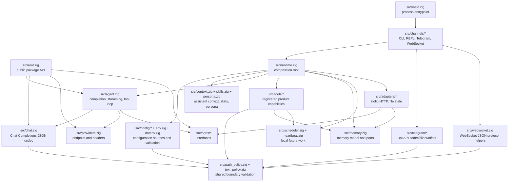
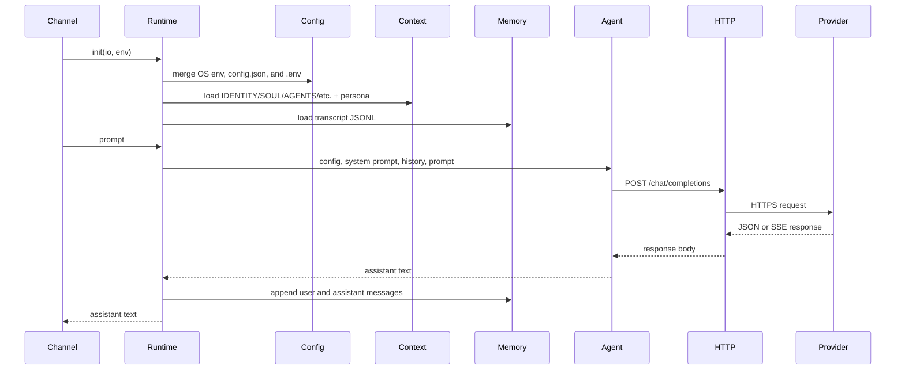
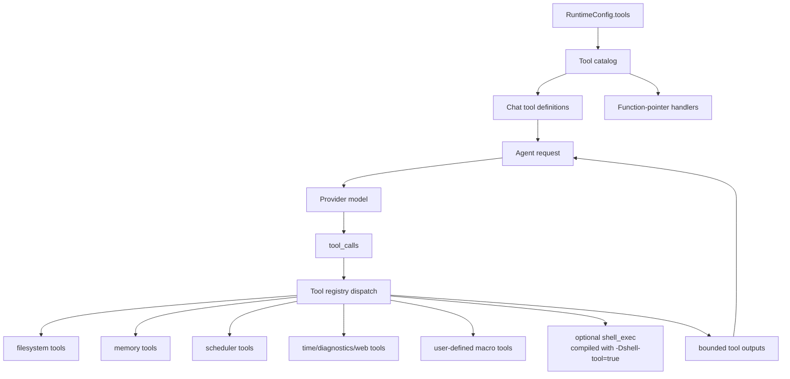
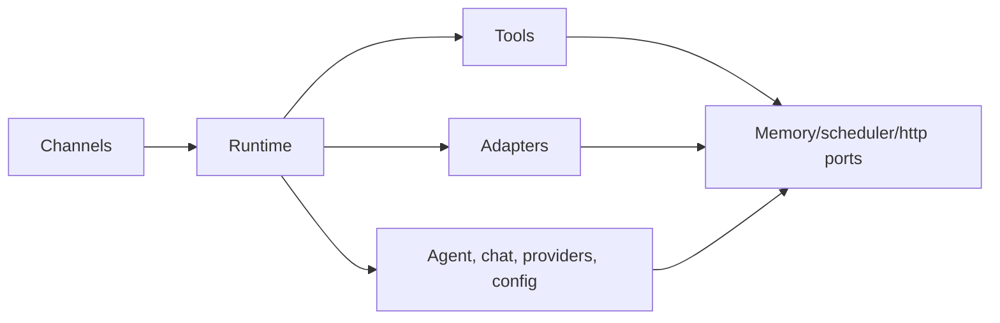

# 架构

`nllclw` 是一个紧凑的 AI assistant，由一个 Zig package 加一个 executable
构成。主要设计目标是在交付小型 standalone binary 的同时，让 agent engine
保持可测试。

## 目标

- 保持 provider wire contract 简单：OpenAI-compatible Chat Completions。
- 保持 runtime dependencies 显式：默认 build 只使用 Zig stdlib。
- 将本地 capabilities 放在 capability gates 后，并便于审计。
- 保持 channels 精简：CLI、REPL、Telegram、WebSocket、heartbeat 和 daemon
  都调用同一个 runtime 和 agent engine。
- 保持 public package API 足够小，便于教学。

## Layer map



## Request flow

同一个 engine 处理 argv prompts、stdin prompts、REPL turns、Telegram
messages、WebSocket prompts、heartbeat tasks 和 due schedules。



## Tool loop flow

Tools 是 product capabilities，不是 infrastructure adapters。它们位于
`src/tools/`，并且只通过 `src/tools/catalog.zig` 暴露给 model。



Agent 重复这个 loop，直到发生以下三种情况之一：

- model 返回没有 tool calls 的 assistant content；
- 达到 `NLLCLW_TOOL_MAX_ROUNDS`；
- 出现 provider error、malformed provider response、allocation failure 或其他
  fatal dispatch error。

Non-fatal tool failures 会作为 `tool error: ...` tool messages 返回给 model，
使 model 可以恢复、选择不同 arguments 或解释失败。Allocation failures 仍会
中止本 turn。

启用 tools 时，streaming 会被故意关闭。Assistant 需要完整的 model response
才能知道要运行哪些 tool calls。

`src/chat.zig` 在 JSON encoding 之前，将每个 request string 验证为不含
binary control bytes 的 UTF-8 text。这让 Chat Completions fields 保持为 JSON
strings，而不是让 arbitrary byte slices 退化成 arrays。对于 SSE，`[DONE]`
是 terminal；后续 chunks 会被忽略。

## Module responsibilities

| Path | Responsibility |
|---|---|
| `src/main.zig` | 最小 executable entrypoint 和 process exit。 |
| `src/root.zig` | Stable public API: config, chat types, HTTP port, streaming sink, `complete`. |
| `src/runtime.zig` | CLI-like operation 的 composition root: config, HTTP adapter, memory adapter, context, tools. |
| `src/agent.zig` | Channel-neutral one-turn assistant engine、streaming 和 tool loop。 |
| `src/chat.zig` | Chat Completions 的 JSON request/response codec，包括 tools 和 SSE chunks。 |
| `src/providers.zig` | Provider presets 和 compatible-provider endpoint validation。 |
| `src/config/*` | Typed runtime config、source collection、validation 和 owned copies。 |
| `src/channels/*` | CLI、REPL、Telegram、WebSocket 和 daemon commands 的 user I/O orchestration。 |
| `src/tools/*` | Tool definitions、local capabilities 和 user-defined macro tools。 |
| `src/skills.zig` | 用于 on-demand local skill loading 的紧凑 `skills/*.md` index。 |
| `src/persona.zig` | 附加到 system prompt 的 runtime presentation modes。 |
| `src/memory.zig` | Transcript/fact models、JSONL parsers 和 memory store ports。 |
| `src/adapters/*` | Ports 的具体 stdlib adapters。 |
| `src/ports/*` | 用于 testable boundaries 的 function-pointer interfaces。 |
| `src/telegram/*` | Telegram Bot API wire helpers。 |
| `src/websocket.zig` | 可测试的 WebSocket JSON message/event helpers。 |

## Public package API

Consumers 将 package module 导入为 `nllclw`。导出的 surface 很小：

```zig
const nllclw = @import("nllclw");

const cfg: nllclw.Config = .{
    .provider = .openrouter,
    .api_key = "...",
    .model = "openai/gpt-chat-latest",
};

const text = try nllclw.complete(allocator, http_client, cfg, "hello");
```

Public API 暴露：

- `ProviderKind`
- `PersonaKind`
- `Config`
- chat request/tool types
- `HttpClient`, `HttpResponse`, `HttpHeader`, `HttpStatusCode`
- `Diagnostic`
- `ToolOptions`, `ToolHandler`, `ToolRunError`, `CompleteOptions`
- `StreamError`, `StreamSink`
- `complete` 和 `completeWithOptions`

Runtime-only details，例如 `config.json`/`.env` loading、file memory、Telegram
polling 和 stdlib HTTP adapter，都留在 public root 外。Public tool handler
只是 `ToolOptions` 需要的 function-pointer abstraction；built-in product tools
及其 file-backed stores 仍保持 internal。

## Dependency direction

依赖方向是显式的：



Core code 不知道 process env、`config.json`、`.env`、filesystem paths、
Telegram polling 或 `std.http.Client`。这些细节由 `runtime.zig` 和 channels
组装。

## Memory ownership

代码遵循 Zig 的显式 ownership 风格：

- 分配内存的 functions 返回 owned slices，并在 call sites 附近通过
  `defer`/`deinit` patterns 记录 ownership。
- Long-lived runtime state 属于 `Runtime`，并在 `Runtime.deinit` 中释放。
- Parsed config 可以从 source buffers borrowed，也可以复制到 `config.Owned`
  用于 runtime storage。
- Tool outputs 属于 agent，直到它们被送回 model，然后在 loop 后释放。

## Cross-platform runtime model

Default binary 旨在运行于 Zig 和 Zig standard library 可支持的任何 target：

- 无 `curl`；
- 无 provider SDK；
- `build.zig.zon` 中无 package dependencies；
- default build 中无 shell process；
- 使用 `std.http.Client` 做 HTTPS；
- 使用 `std.Io` 处理 files、stdin/stdout/stderr 和 timers。

Optional shell tool 是单独的 build flavor：

```sh
zig build -Dshell-tool=true
```

该 flavor 不是 default，因为 runtime 启用后它可以启动 `sh` 或 `cmd.exe`。
