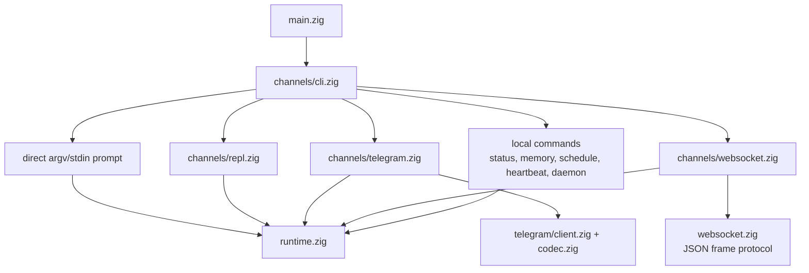
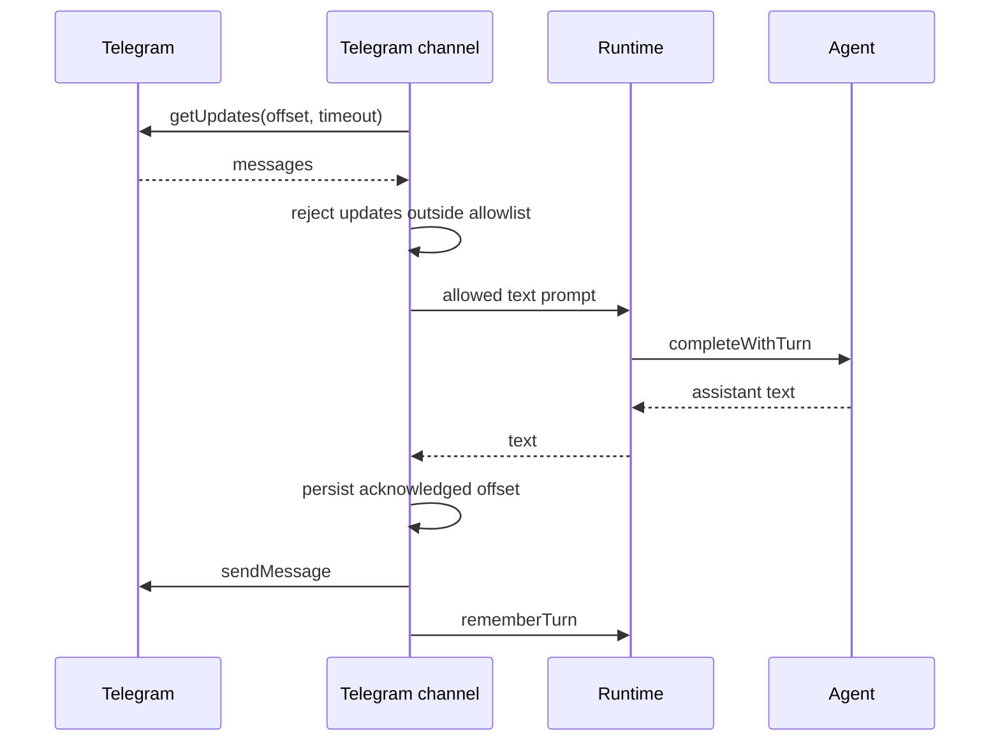
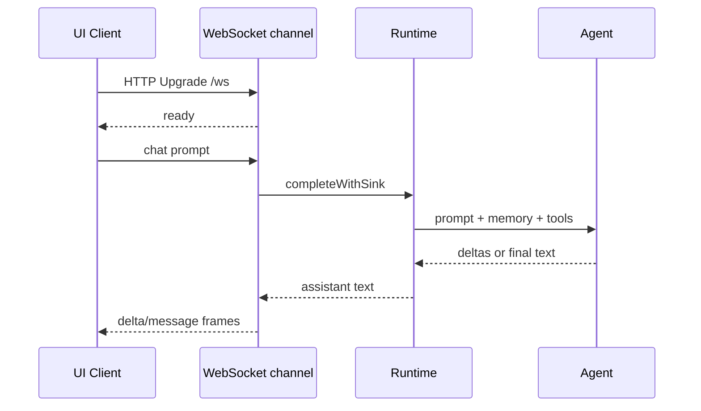

# Channels

Channels 是与同一个 runtime 和 agent engine 交互的用户入口。它们解析输入，
拥有 channel-specific I/O，并把 completions 委托给 `runtime.zig`。

## Channel Map



## Direct CLI

从 argv 提供 prompt：

```sh
nllclw "explain this repository in one paragraph"
```

从 stdin 提供 prompt：

```sh
printf 'summarize this text\n' | nllclw
```

`NLLCLW_STREAM=on` 是默认值：

```sh
NLLCLW_STREAM=on
```

Tool loop 也默认开启；tool output 是 non-streaming，因为 agent 必须先检查完整
tool calls，才能分派 local functions。纯 streaming chat 可设置
`NLLCLW_TOOLS=off`。

Direct slash commands 在本地处理：

```sh
nllclw /settings
nllclw /diag memory
nllclw /persona technical
```

这些命令不会调用 model。

## Interactive REPL

当 stdin 是 TTY 且没有提供 prompt 时，`nllclw` 会启动一个小型 terminal
chat loop：

```sh
nllclw
```

退出命令：

```text
:q
:quit
exit
```

每个 turn 使用与 direct CLI mode 相同的 runtime memory 和 tool configuration。

## Telegram

Telegram mode 使用 Bot API long polling：

```sh
NLLCLW_TELEGRAM_TOKEN=123456:bot-token
NLLCLW_TELEGRAM_CHAT_ID=123456789
nllclw telegram
```

`NLLCLW_TELEGRAM_CHAT_ID` 也可以是 private-chat 或 public-chat Telegram
username，带不带 `@` 都可以，例如 `@donprus` 或 `donprus`。

Security properties：

- `NLLCLW_TELEGRAM_CHAT_ID` 是必需项；
- 配置的 chat id 或 username allowlist 之外的消息会被忽略；
- local nonblocking lock 会在第二个 `nllclw telegram` process 到达 Bot API
  polling 前，在同一个 state directory 上阻止它；
- 接受的 message text 必须是 valid UTF-8，且不能包含 binary control bytes；
  malformed text updates 会被跳过，但 polling offset 仍会前进；
- last acknowledged update id 存储在 user state directory 中；
- 重启后从存储的 offset 继续，不会 replay 已处理消息。
- model-backed messages 受 `NLLCLW_TELEGRAM_RATE_LIMIT_PER_MINUTE` 限速
  （默认 `20`，`0` 表示禁用）；local slash commands 不限速。

如果另一台机器、deployment 或旧 binary 已经用同一个 bot token 调用
`getUpdates`，Telegram 会返回 HTTP `409`。`nllclw` 会针对该冲突打印明确提示。

Flow：



## WebSocket

WebSocket mode 会启动一个 local RFC6455 server，供 custom browser、desktop 或
mobile UIs 使用：

```sh
NLLCLW_WS_TOKEN=change-me nllclw websocket
```

Default bind settings：

```sh
NLLCLW_WS_HOST=127.0.0.1
NLLCLW_WS_PORT=8765
NLLCLW_WS_PATH=/ws
```

Default bind address 仅限 loopback，但 channel 仍要求 `NLLCLW_WS_TOKEN`，
这样随机 browser pages 无法访问 local agent。Remote binds 同时要求：

```sh
env NLLCLW_WS_HOST=0.0.0.0 \
  NLLCLW_WS_ALLOW_REMOTE=on \
  NLLCLW_WS_TOKEN=change-me \
  nllclw websocket
```

Loopback browser clients 可以通过 query parameter 传 token：

```js
const socket = new WebSocket("ws://127.0.0.1:8765/ws?token=change-me");

socket.addEventListener("message", (event) => {
  const message = JSON.parse(event.data);
  console.log(message.type, message.content ?? message.message);
});

socket.addEventListener("open", () => {
  socket.send(JSON.stringify({
    type: "chat",
    prompt: "Explain this repository in one paragraph."
  }));
});
```

Query authentication 只接受一个 `token` parameter。重复 token parameters 会因
ambiguous 而被拒绝。

Remote clients 必须使用且只使用一个 bearer token header。基于 browser 的
remote UIs 应通过受信任的 local 或 reverse proxy 连接，由该 proxy 注入 header。

```text
Authorization: Bearer change-me
```

Client messages：

```json
{ "type": "chat", "prompt": "hello" }
{ "type": "status" }
{ "type": "ping" }
{ "type": "close" }
```

Plain text frames 会作为 chat prompts 被 simple clients 接受。Text frames 必须是
valid UTF-8，且不能包含 binary control bytes。
JSON command frames 必须是 exact objects；unknown fields 会被拒绝，且只有
`chat`/`message` frames 可以包含 `prompt`。
Server 一次只处理一个 active WebSocket client。active client 断开后，其他
clients 可以连接。

Server messages：

```json
{ "type": "ready", "version": 1, "channel": "websocket" }
{ "type": "delta", "content": "partial text" }
{ "type": "message", "content": "final text" }
{ "type": "status", "content": "nllclw: ok ..." }
{ "type": "pong", "content": "pong" }
{ "type": "error", "message": "request failed" }
```

只有当 `NLLCLW_STREAM=on` 且 `NLLCLW_TOOLS=off` 时才会发出 `delta` frames。
启用 tools 时，model 必须先完成 tool-call planning，channel 才能发送最终的
`message`。

Flow：



## Local Commands

Local commands 不会询问 model，除非该 command 明确运行一个 task：

```sh
nllclw status
nllclw doctor
nllclw memory list
nllclw memory get project.goal
nllclw memory forget project.goal
nllclw memory reset
nllclw schedule list
nllclw schedule delete 1
```

`status` 打印 quick health line。`doctor` 打印完整 diagnostics report。

## Shared Slash Commands

REPL、Telegram 和 direct CLI 共享同一个 slash parser：

| Command | Effect |
|---|---|
| `/start`, `/help` | 显示 local command help。 |
| `/settings` | 显示 quick runtime status。 |
| `/diag [scope]` | 显示 `quick`、`runtime`、`memory`、`rates`、`time` 或 `all` 的 diagnostics。 |
| `/persona [mode]` | 显示或设置 runtime persona：`neutral`、`friendly`、`technical`、`witty`。 |
| `/stop` | 暂停当前 process 的 Telegram intake。其他 channels 会报告它仅用于 Telegram。 |
| `/resume` | 恢复 Telegram intake。其他 channels 会报告它仅用于 Telegram。 |
| `/chatid` | 可用时打印 Telegram chat id 和 username fields。其他 channels 会报告它仅用于 Telegram。 |

Persona changes 只影响当前 process 的 runtime。要选择 startup persona，请设置
`NLLCLW_PERSONA`。

## Heartbeat

`nllclw heartbeat` 读取 `HEARTBEAT.md`，并把 pending items 转成一个 prompt。
只有保守的 task syntax 会被视为 actionable：

- unchecked markdown task lines；
- 以 `TODO:` 开头的 lines。

```sh
nllclw heartbeat
```

如果未找到 pending task，该 command 会打印一条短消息并成功退出。

## Daemon

`nllclw daemon` 会重复：

1. 从 user state directory claim due scheduled tasks；
2. 通过 normal runtime 运行每个 claimed task；
3. 只 commit completed schedule entries；
4. 定期运行 heartbeat prompts。

```sh
NLLCLW_DAEMON_INTERVAL_SECONDS=60
NLLCLW_HEARTBEAT_INTERVAL_SECONDS=1800
nllclw daemon
```

Daemon 是 local 且 file-backed 的。它不会跨多台机器协调。

Claimed schedules 使用 local lease。如果 provider execution、destination
preflight 或 delivery 失败，该 task 不会被 committed；lease 过期后它会再次
eligible。

当 schedule 从 Telegram 创建时，`cron_set` 默认使用 `channel=telegram` 和当前
chat id。Daemon 会用 `NLLCLW_TELEGRAM_TOKEN` 把 completed scheduled result 发回
该 chat。Local schedules 仍写到 stdout。
