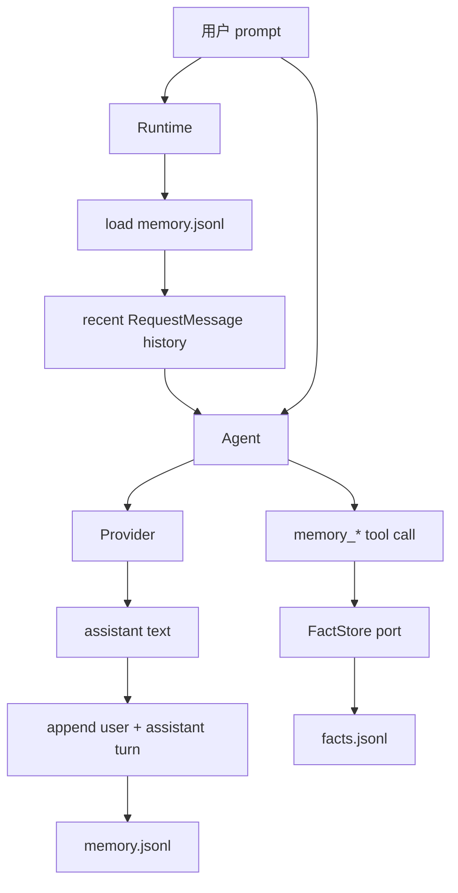
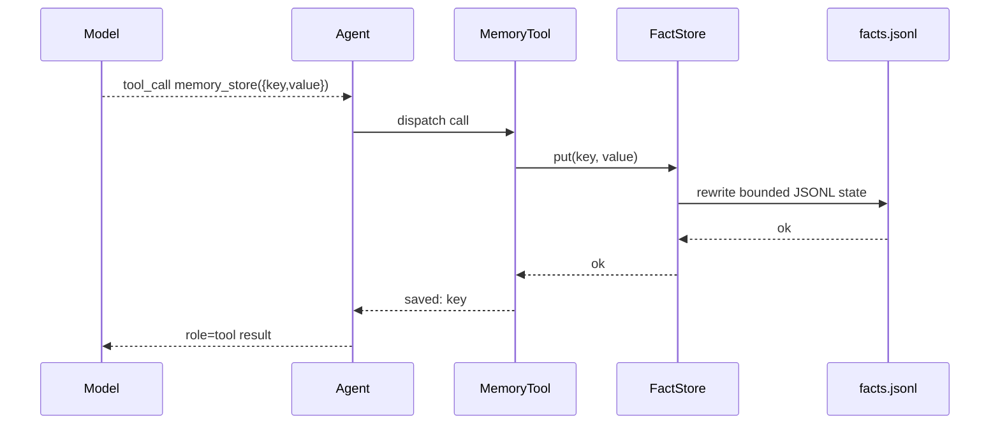

# Memory

`nllclw` 有两个 memory systems：

1. transcript memory，保存最近的 user/assistant turns；
2. durable fact memory，通过显式 tools 存储 keyed facts。

两者默认都是 user state directory 中的 JSONL files，而不是 binary 旁边，
也不是当前 project 中。

## 概览



## Transcript Memory

Transcript memory 默认启用：

```sh
NLLCLW_MEMORY=on
# Default: user state dir/memory.jsonl
NLLCLW_MEMORY_MAX_MESSAGES=20
```

`NLLCLW_MEMORY_MAX_MESSAGES` 必须至少为 2，因为 transcript appends 以
user/assistant pairs 存储。

每一行都是一个 JSON object：

```json
{"role":"user","content":"remember that this project uses Zig 0.16"}
{"role":"assistant","content":"Got it."}
```

每个 turn 启动时：

1. `runtime.zig` 打开配置的 transcript store。
2. `memory.zig` 解析 JSONL lines。
3. Invalid roles、invalid JSON、invalid UTF-8 或 binary control bytes 会产生
   memory error。
4. 只保留最新的 `NLLCLW_MEMORY_MAX_MESSAGES` entries。
5. Entries 被转换为 Chat Completions request messages。

Assistant response 成功后，`Runtime.appendMemory` 会追加用户 prompt 和
assistant text。如果 append 失败，已生成的 assistant answer 仍会打印，
channel 会报告 warning。

Transcript snapshots 限制为 256 KiB，与加载 JSONL file 时使用的限制相同。
过大的 turns 会在 atomic replace 前被拒绝，因此成功写入不会创建下次
startup 无法读取的 transcript。

## Durable Fact Memory

Fact memory 用于稳定的 key/value facts。当满足以下条件时，它可通过默认
local tool loop 使用：

```sh
NLLCLW_MEMORY=on
NLLCLW_TOOLS=on
```

Defaults：

```sh
# Default path: user state dir/facts.jsonl
NLLCLW_MEMORY_MAX_FACTS=64
```

`NLLCLW_MEMORY_MAX_FACTS` 必须在 1 到 1024 之间。

每一行都是一个 JSON object：

```json
{"key":"project.language","value":"Zig 0.16"}
{"key":"user.prefers","value":"direct, pragmatic answers"}
```

Fact keys：

- 必须非空；
- 限制为 64 bytes；
- 可包含字母、数字、`_`、`-` 和 `.`；
- 按 key deduplicate，最新 value 获胜。

Fact values：

- 必须非空；
- 必须包含 non-whitespace text；
- 必须是 valid UTF-8；
- 不得包含 ASCII control bytes；
- 限制为 2048 bytes；
- 由 `memory_recall` 返回时必须放入 `NLLCLW_TOOL_OUTPUT_MAX_BYTES`。

Fact JSONL snapshot 使用与 transcript memory 相同的 256 KiB read/write cap。
如果保留的 facts 太多而超过该 file limit，写入会失败，而不是创建无法
读取的 facts file。

## Memory tools

| Tool | 用途 |
|---|---|
| `memory_store` | 按 key 存储或更新 fact。 |
| `memory_recall` | 按 key 读取 fact。 |
| `memory_list` | 列出已知 fact keys。 |
| `memory_forget` | 按 key 删除 fact。 |

Tool flow：



## CLI memory commands

这些 commands 操作 durable facts：

```sh
nllclw memory list
nllclw memory get project.language
nllclw memory forget project.language
nllclw memory reset
```

`memory reset` 会清除 transcript memory 和 fact memory。

## 隐私和安全说明

- Memory files 默认位于 user state directory。
- Filesystem tools 会拒绝 `.nllclw-*` files，因此 model 无法通过
  `read_file`、`write_file` 或 `edit_file` 读取或编辑自己的 memory files。
- Memory 不加密。不要在其中存储 secrets。
- Fact memory 应用于持久的用户/项目偏好，而不是 raw conversation logs。
