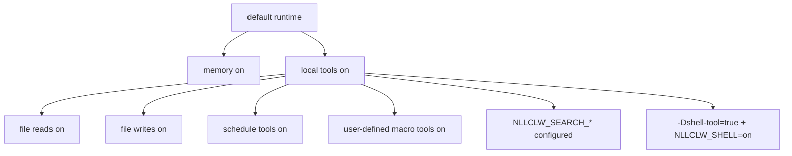

# Security model

`nllclw` 是本地 AI assistant，不是 sandbox。它的安全模型基于小而
local-only 的默认设置、显式 external capability gates、有界本地输出，以及
谨慎的 provider/config validation。

## Default posture

Default build：

- 无 package dependencies；
- 无 external runtime programs；
- 无 `curl`；
- 无 shell execution；
- local tools 启用；
- filesystem tools 启用，并带有 relative-path 和 secret-path protections；
- scheduler tools 启用，用于本地 JSONL schedules；
- user-defined macro tools 启用，并存储在本地 JSONL 中；
- web search 禁用，除非配置 search provider；
- Telegram 禁用，除非显式启动并配置 allowlist。
- WebSocket 禁用，除非显式启动；default bind 仅为 loopback。

Memory 默认启用，因为它只在当前工作目录写入本地 JSONL files。可以这样禁用：

```sh
NLLCLW_MEMORY=off
```

禁用所有 tools：

```sh
NLLCLW_TOOLS=off
```

## Capability gates



Model 默认接收 local tool definitions。External web search 和 shell execution
仍需要显式设置。

## Provider-key handling

- API keys 来自 OS env、`config.json` 或 `.env`。
- OS env 覆盖 file config，`config.json` 覆盖 `.env`。
- Completion provider keys 只作为 `Authorization: Bearer ...` 发送。
- Search provider keys 使用各 provider 文档规定的 auth header 发送：
  Tavily 和 Firecrawl 使用 bearer auth，Brave Search 使用
  `X-Subscription-Token`，Exa 使用 `x-api-key`。
- Header values 拒绝 ASCII control bytes。
- Provider model names 在 request JSON 构建前拒绝 invalid UTF-8 和 control
  bytes。
- Chat request content strings、assistant response text 和 tool-call argument
  strings 拒绝 invalid UTF-8 和 binary control bytes；普通 newlines、carriage
  returns 和 tabs 在这些位置仍是 valid text。Request metadata，例如 model
  names、roles、tool-call ids、function names 和 parameter names，还必须是
  single-line。
- Provider response roles 存在时必须为 `assistant`。
- Provider and Telegram diagnostic messages 如果为空、过大或包含 control
  bytes，不会作为 trusted single-line errors 打印。
- Raw diagnostic response bodies 只有在 valid text 且 terminal output 中受限时
  才打印。
- Default state files 位于 user state directory。Memory、macro tools 和
  schedules 的 configured state paths 必须是 user state directory 下的 relative
  `.jsonl` paths，使用 valid UTF-8，不含 control bytes，使用 `/` separators，
  不含 Windows-reserved filename characters 或 device names，也不含 empty、
  `.`, `..`, trailing-space 或 trailing-dot path components。
- Local state files 及其 lock files 会在不跟随 terminal symlinks 的情况下打开。
  Writes 使用 atomic replace，并在 host platform 支持时使用 private file
  permissions。
- Durable fact memory values 在存储或通过 CLI/tool recall 路径打印前拒绝
  ASCII control bytes。
- User-defined macro tool descriptions and actions 在存储或作为 model-facing
  tool schema/output 返回前拒绝 ASCII control bytes。
- Scheduled actions 在存储或通过 schedule listing 打印前拒绝 ASCII control
  bytes。
- Model-facing tool outputs 拒绝 invalid UTF-8 和 binary control bytes。
- `.env`、`config.json` 和 `.nllclw-*` paths 被 filesystem tools 拒绝。
- user-defined macro tools 默认存储在 user state directory。
- 不要把真实 keys 粘贴到 prompts 或 context files 中。

## Compatible provider safety

Compatible providers 默认必须使用 HTTPS：

```json
{
  "provider": "compatible",
  "base_url": "https://example.com/v1",
  "api_key": "...",
  "model": "..."
}
```

HTTP 仅允许 exact loopback hosts，且必须显式启用：

```json
{
  "provider": "compatible",
  "base_url": "http://127.0.0.1:11434/v1",
  "allow_http_base_url": true,
  "api_key": "ollama",
  "model": "llama3.2"
}
```

Remote HTTP URLs 会被拒绝。

## Filesystem tool boundary

Filesystem tools 不是完整 sandbox，但会执行保守的本地边界：

- 仅 relative paths；
- valid UTF-8、control-free paths，长度不超过 512 bytes；
- 不允许 `..`；
- 不允许 absolute POSIX paths；
- 不允许 absolute 或 drive-qualified Windows paths；
- 不允许 empty、`.` 或 `..` path components，但 `list_dir` 接受 literal `.`
  表示当前目录；
- 打开的 path components 不允许 symlink traversal；
- 不允许 Windows-reserved filename characters、device names、trailing spaces
  或 trailing dots；
- 不允许 `.env`、`config.json`、`.nllclw-*`、`.git`、`.ssh`、`.gnupg`、`.aws`、`.npmrc`；
- 不允许 common private-key filenames 或 suffixes；
- 仅 UTF-8 text，不含 binary control bytes；
- output-size caps；
- atomic writes。

只在你认为这些权限合适的目录中启用 file tools 运行。

## Telegram boundary

Telegram mode 默认拒绝：

- `NLLCLW_TELEGRAM_TOKEN` 必填；
- Telegram tokens 在放入 Bot API URLs 前被验证为 `<bot-id>:<secret>`；
- `NLLCLW_TELEGRAM_CHAT_ID` 必填；
- 配置的 chat id 或 username allowlist 之外的消息会被忽略；
- local nonblocking lock 会拒绝在同一 state directory 使用第二个
  `nllclw telegram` 进程；
- 最后处理的 update 存储在本地，以避免 restart 后 replay。
- model-backed messages 通过 `NLLCLW_TELEGRAM_RATE_LIMIT_PER_MINUTE` 做
  rate limit。

## WebSocket boundary

WebSocket mode 默认用于本地 custom UIs：

- 仅在启动 `nllclw websocket` 时开始；
- default bind 是 `127.0.0.1:8765`；
- 即使是 loopback binds，`NLLCLW_WS_TOKEN` 也必填；
- `NLLCLW_WS_PATH` 必须是 single-line valid UTF-8，且不含 query 或 fragment
  syntax；
- non-loopback bind addresses 需要 `NLLCLW_WS_ALLOW_REMOTE=on`；
- loopback browser clients 可将 token 作为 `?token=...` 传递；
- loopback query authentication 只接受一个 `token` parameter；
- remote clients 必须只使用一个 `Authorization: Bearer ...` header；
- model-backed chat messages 通过 `NLLCLW_WS_RATE_LIMIT_PER_MINUTE` 做
  rate limit。
- 内置 server 一次只处理一个 active client。

不要在没有 reverse proxy 和 transport security 的情况下，将 WebSocket port
暴露给不可信网络。内置 channel 是 plain `ws://`，不是 TLS termination。

## Shell tool boundary

Default binary 不包含 `shell_exec`。

要让 shell execution 成为可能，两个条件都必须为真：

```sh
zig build -Dshell-tool=true
NLLCLW_SHELL=on
```

Shell tool 应被视为等同于授予 model 本地 command execution。仅在 trusted
environments 中使用。

## Practical checklist

使用默认本地 capabilities 前：

1. 在专用 project directory 中运行。
2. 不要在 prompts 和 context files 中放 secrets。
3. 如果不希望 file mutation，设置 `NLLCLW_FILE_WRITE=off`。
4. 除非需要 command execution，否则使用 default no-shell binary。
5. 使用 `NLLCLW_TOOL_OUTPUT_MAX_BYTES` 保持 tool output 有界。
6. 使用 `nllclw status` 查看 quick health line，或使用 `nllclw doctor` 查看
   full diagnostics。
