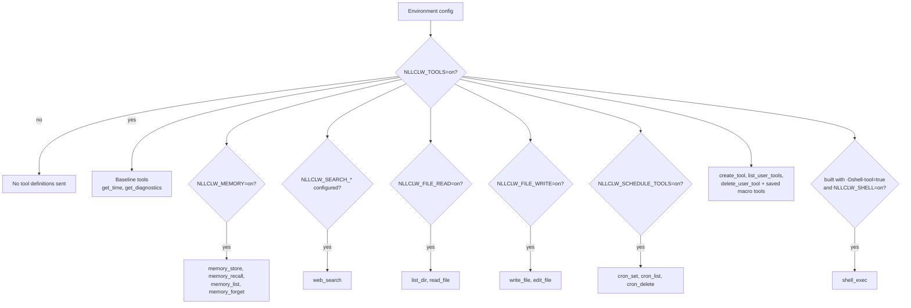
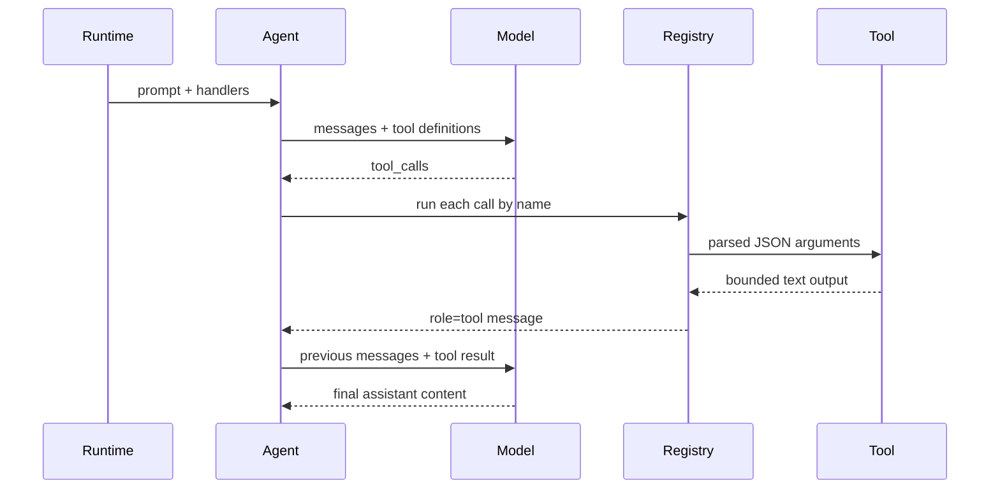

# Tools

Tools 允许 model 请求 `nllclw` 执行本地动作。不需要 external services 的
local tools 默认启用。External web search 和 optional shell execution 仍需要
显式设置。

## Capability model



Default binary 不包含 `shell_exec`。显式 build：

```sh
zig build -Dshell-tool=true
```

然后在 runtime 启用：

```sh
NLLCLW_TOOLS=on
NLLCLW_SHELL=on
```

禁用所有 tools：

```sh
NLLCLW_TOOLS=off
```

## Tool loop



`NLLCLW_TOOL_MAX_ROUNDS` 限制 agent 返回 `ToolRoundLimit` 前可发生的
assistant/tool exchange rounds 数量。

Built-in tool arguments 是 exact JSON objects。Invalid JSON、缺少 required
fields、unknown fields、invalid field types 和 validation failures 都会返回
tool error 供 model 处理。

## Available tools

| Tool | Gate | Effect |
|---|---|---|
| `get_time` | `NLLCLW_TOOLS=on` default | 使用 `NLLCLW_TIMEZONE_OFFSET_MINUTES` 返回 local time。 |
| `get_diagnostics` | `NLLCLW_TOOLS=on` default | 报告 runtime capability/config status。 |
| `web_search` | `NLLCLW_TOOLS=on` 且配置了 `NLLCLW_SEARCH_*` provider | 通过 HTTP port 调用选定 search provider。 |
| `memory_store` | `NLLCLW_TOOLS=on`, `NLLCLW_MEMORY=on` defaults | 存储 durable fact。 |
| `memory_recall` | `NLLCLW_TOOLS=on`, `NLLCLW_MEMORY=on` defaults | 读取 durable fact。 |
| `memory_list` | `NLLCLW_TOOLS=on`, `NLLCLW_MEMORY=on` defaults | 列出 durable fact keys。 |
| `memory_forget` | `NLLCLW_TOOLS=on`, `NLLCLW_MEMORY=on` defaults | 删除 durable fact。 |
| `list_dir` | `NLLCLW_FILE_READ=on` default | 列出 CWD-relative directory。 |
| `read_file` | `NLLCLW_FILE_READ=on` default | 读取 UTF-8 CWD-relative file。 |
| `write_file` | `NLLCLW_FILE_WRITE=on` default | 以 atomic 方式写入 UTF-8 CWD-relative file。 |
| `edit_file` | `NLLCLW_FILE_WRITE=on` default | 替换文件中第一个 exact text match。 |
| `cron_set` | `NLLCLW_SCHEDULE_TOOLS=on` default | 添加本地 scheduled task。 |
| `cron_list` | `NLLCLW_SCHEDULE_TOOLS=on` default | 列出 scheduled tasks。 |
| `cron_delete` | `NLLCLW_SCHEDULE_TOOLS=on` default | 删除 scheduled task。 |
| `create_tool` | `NLLCLW_TOOLS=on` default | 创建 persistent user-defined macro tool。 |
| `list_user_tools` | `NLLCLW_TOOLS=on` default | 列出 saved macro tools。 |
| `delete_user_tool` | `NLLCLW_TOOLS=on` default | 删除 saved macro tool。 |
| saved macro tools | `NLLCLW_TOOLS=on` default | 返回 saved action text，让 model 通过 built-in tools 执行它。 |
| `shell_exec` | optional shell build plus `NLLCLW_SHELL=on` | 运行带 timeout、combined output cap 和无 binary control bytes UTF-8 text output 的 shell command。 |

## User-defined tools

User-defined tools 是 macro tools，不是 generated code。`create_tool` 将 name、
description 和 natural-language action 存储在 `NLLCLW_USER_TOOLS_PATH`
（default 为 user state directory 中的 `user-tools.jsonl`）。
在之后的 turns 中，saved tools 作为普通 tool definitions 公布。当 model 调用
其中一个时，`nllclw` 返回 saved action text，model 用 built-in tools 继续同一
tool loop。

Example：

```text
create_tool(name="daily_brief", description="Prepare a daily brief", action="Search for current project news, summarize it, and store the summary in memory.")
```

Tool names 只能包含字母、数字和 underscores。与 built-in tools 冲突的名称会被
拒绝。Descriptions 和 actions 会被 trimmed、bounded，并且必须是无 ASCII
control bytes 的 valid UTF-8 text。User-tool JSONL file 在 read 和 write 时
都限制为 128 KiB，会在不跟随 terminal symlinks 的情况下打开；saved action
包装为 tool result 时必须能放入 `NLLCLW_TOOL_OUTPUT_MAX_BYTES`。

## Web search providers

`web_search` 是一个工具，provider 由 `NLLCLW_SEARCH_PROVIDER` 选择。Default
`auto` mode 按顺序选择第一个配置的 key：Tavily、Brave Search、Exa、
Firecrawl，然后只有显式启用时才选择 DuckDuckGo。
Explicit key-based providers 需要对应的 `NLLCLW_SEARCH_*_KEY`。
Search keys 不得包含 ASCII control bytes。
Queries 会被 trimmed，必须是 valid UTF-8、control-free，且最多 512 bytes。
Provider result text 被格式化为无 binary control bytes 的 valid UTF-8；result
fields 中的普通 tabs 和 newlines 会被规范化为空格。
Empty provider result objects 会被跳过，valid empty provider response 会返回
`no results`，而不是 synthetic placeholder row。DuckDuckGo nested related-topic
groups 会在小的 bounded depth 内 flatten。

| Provider | Env | Notes |
|---|---|---|
| `tavily` | `NLLCLW_SEARCH_TAVILY_KEY=...` | POSTs to Tavily Search. |
| `brave` | `NLLCLW_SEARCH_BRAVE_KEY=...` | GETs Brave Web Search with `X-Subscription-Token`. |
| `exa` | `NLLCLW_SEARCH_EXA_KEY=...` | POSTs Exa Search with `x-api-key`. |
| `firecrawl` | `NLLCLW_SEARCH_FIRECRAWL_KEY=...` | POSTs Firecrawl Search with bearer auth. |
| `duckduckgo` | `NLLCLW_SEARCH_DUCKDUCKGO=on` or `NLLCLW_SEARCH_PROVIDER=duckduckgo` | No-key Instant Answer fallback, not a full web SERP API. |

Examples：

```sh
NLLCLW_TOOLS=on
NLLCLW_SEARCH_PROVIDER=auto
NLLCLW_SEARCH_BRAVE_KEY=...
```

```sh
NLLCLW_TOOLS=on
NLLCLW_SEARCH_PROVIDER=duckduckgo
```

## Scheduled delivery

`cron_set` 接受用于 delivery 的 `channel` 和 `chat_id`。在 Telegram turns 中，
当前 chat 会成为 default destination，因此像 "remind me here tomorrow" 这样的
prompt 可以创建 Telegram schedule，而不会在 model-facing user text 中暴露
chat id。

Scheduled actions 会被 trimmed，必须是无 ASCII control bytes 的 valid UTF-8，
并限制为 2048 bytes。Schedule JSONL file 在 read 和 write 时都限制为 128 KiB；
oversized snapshots 会在 atomic replacement 前被拒绝。
`cron_set` 只接受与其 `type` 匹配的 timing fields：periodic schedules 使用
`interval_*`，one-shot schedules 使用 `delay_*`，daily schedules 使用
`hour`/`minute`。
Daemon 只在 scheduled prompt 完成且任何配置的 delivery 成功后 commit schedule；
failed 或 blocked deliveries 会在 local lease 过期后 retry。

支持的 destinations：

| Channel | Behavior |
|---|---|
| `local` | Daemon 将结果写入 stdout。 |
| `telegram` | Daemon 使用 `NLLCLW_TELEGRAM_TOKEN` 将结果发送到存储的 Telegram chat id。 |

## Filesystem safety model

Filesystem tools 很保守：

- paths 必须相对于 current working directory；
- paths 必须是 valid UTF-8、control-free，且最多 512 bytes；
- absolute POSIX paths 会被拒绝；
- absolute 或 drive-qualified Windows paths 会被拒绝；
- empty、`.` 和 `..` components 会被拒绝，但 `list_dir` 接受 literal `.`
  表示当前目录；
- denied components 包括 `.env`、`.env.*`、`config.json`、`.nllclw-*`、
  `.git`、`.ssh`、`.gnupg`、`.aws`、`.npmrc`、`id_rsa`、`id_ed25519`；
- denied Windows device names 包括 `CON`、`PRN`、`AUX`、`NUL`、`CONIN$`、
  `CONOUT$`、`COM1` through `COM9` 和 `LPT1` through `LPT9`，包括带
  extensions 的形式；
- Windows-reserved filename punctuation (`<`, `>`, `:`, `"`, `|`, `?`, `*`)
  为 portable behavior 而被拒绝；
- 以空格或点结尾的 path components 为 portable behavior 而被拒绝；
- denied suffixes 包括 `.pem`、`.key`、`.p12`、`.pfx`；
- intermediate directories 在不跟随 symlinks 的情况下打开；
- terminal files 在不跟随 symlinks 的情况下打开；
- reads 和 writes 需要无 binary control bytes 的 valid UTF-8 text；
- `list_dir` 按 sorted order 输出 names，并省略 denied、non-UTF-8 或
  control-character entry names；
- writes 在支持时使用 atomic replacement 和 private file permissions；
- output 受 `NLLCLW_TOOL_OUTPUT_MAX_BYTES` 限制。

这是本地 safety boundary，不是 sandbox。只在你愿意授予已启用 capabilities
的目录中运行 `nllclw`。

## Adding a tool

推荐形式：

1. 在 `src/tools/<name>.zig` 中添加聚焦模块。
2. 定义 `chat.ToolDefinition`。
3. 实现只拥有所需 dependencies 的小型 client struct。
4. 用 `std.json.parseFromSlice` 解析 JSON arguments。
5. 返回受 `NLLCLW_TOOL_OUTPUT_MAX_BYTES` 限制的 owned text output。
6. 如果 handler 读取或改变 local state，就在显式 config gate 后将其注册到
   `src/tools/catalog.zig`。
7. 为 success、invalid JSON/arguments、bounds 和 denied access 添加 tests。

不要把 infrastructure adapters 放在 `src/tools/`。如果 tool 需要 persistence
或 HTTP，请定义或复用 port，并通过 catalog 注入。
